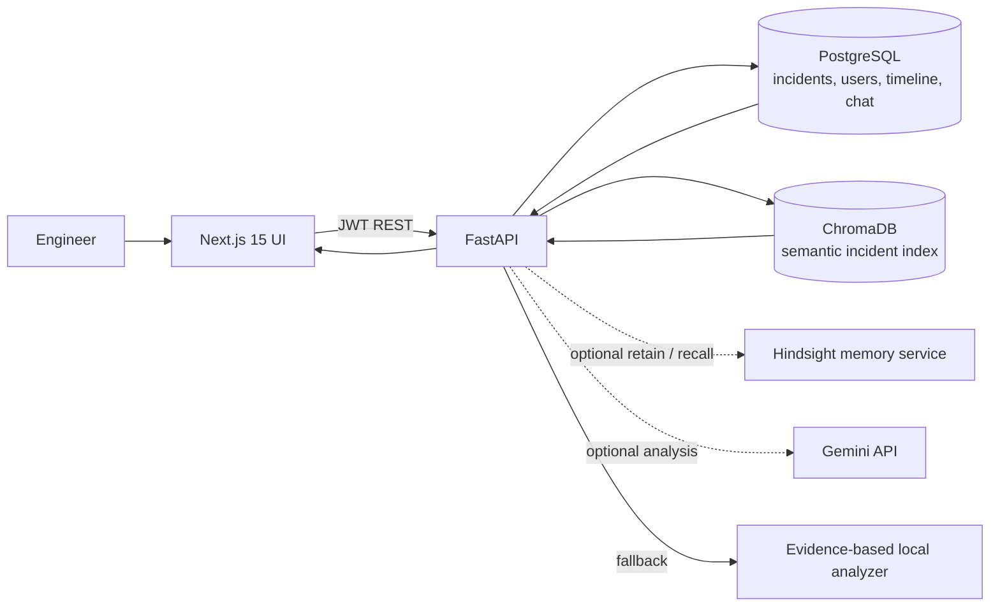

# IncidentMind AI

IncidentMind is an incident response workspace that combines an incident ledger with semantic search and operational memory. It retrieves related incidents, shows previous causes/resolutions/failed fixes, and produces grounded next-step suggestions. It is designed as a hackathon-ready starting point and runs locally with Docker Compose.

## Features

- Responsive light UI: sign-in/register, overview dashboard, incident create/list/detail, incident memory/history, and AI copilot chat.
- FastAPI API with registration/login, bcrypt password hashing, expiring JWTs, request IDs, input validation, CORS configuration, structured logs, and consistent errors.
- PostgreSQL incident records, resolution details, engineer notes, failed attempts, status, timeline, and chat history.
- ChromaDB semantic index using its built-in embedding function; lexical fallback keeps local demo usable if Chroma is unavailable.
- Optional Hindsight retain/recall integration; configurable Gemini analysis with conservative evidence-grounded local mode when no key is configured.
- 50 varied sample incidents automatically loaded on the first Compose start.

## Run locally

Prerequisites: Docker Desktop with Compose enabled. From the repository root:

```bash
cp .env.example .env
```

On PowerShell, use `Copy-Item .env.example .env`. Edit `.env` and replace `POSTGRES_PASSWORD` and `JWT_SECRET` before sharing the environment. For a local hackathon demo, leave `AI_MODE=mock`; this exercises memory-based suggestions without an external key. Start the stack:

```bash
docker compose up --build
```

Open [http://localhost:3000](http://localhost:3000). Register a user (password 10–72 characters). The API docs are at [http://localhost:8000/docs](http://localhost:8000/docs), health at `/health`. The first API startup seeds 50 sample incidents and indexes them; later starts do not duplicate them.

To use Gemini, set `GEMINI_API_KEY` and `AI_MODE=gemini` in `.env`, then restart with `docker compose up -d --build api`. To connect Hindsight, set its API origin in `HINDSIGHT_BASE_URL` (for example `https://api.hindsight.vectorize.io`) plus its API key and bank ID. The integration uses Hindsight's bank-scoped retain and recall endpoints; retain requests are queued asynchronously and use stable incident document IDs. Without it, PostgreSQL and Chroma remain functional. See [Hindsight retain docs](https://docs.hindsight.vectorize.io/api-reference/retain-memories/) and [recall docs](https://docs.hindsight.vectorize.io/api-reference/recall-memories/).

Stop the stack with `docker compose down`. To erase local database/index data too, use `docker compose down -v` (destructive to local demo data).

## Useful commands

```bash
docker compose ps
docker compose logs -f api
docker compose exec api python -m app.seed
docker compose exec api pytest -q
```

The sample seed only inserts when the incident table is empty. Registration is open for local development; restrict it or add invitations/SSO before production use.

## API overview

All endpoints other than `/health` require `Authorization: Bearer <access_token>` except register/login. API prefix: `/api/v1`.

| Method | Route | Purpose |
|---|---|---|
| POST | `/auth/register`, `/auth/login` | Create account / issue JWT |
| GET | `/auth/me` | Current account |
| GET, POST | `/incidents` | Filter/list and create incidents |
| GET, PATCH, DELETE | `/incidents/{id}` | Read, update, delete |
| GET | `/incidents/{id}/timeline` | Incident event history |
| GET | `/incidents/{id}/similar` | Similar historical incidents with scores |
| POST | `/incidents/{id}/analyze` | Root-cause hypothesis and actions |
| POST | `/search` | Search incident memory by query |
| GET | `/dashboard` | Counts, resolution rate, services, recent incidents |
| GET | `/history` | Incidents with recorded learning |
| GET, POST | `/chat/history`, `/chat` | Copilot conversation and durable chat history |

Incident severity is `critical`, `high`, `medium`, or `low`; status is `open`, `investigating`, `mitigated`, or `resolved`. Record failed approaches and mark resolution outcome to make future suggestions safer and more useful.

## Configuration

See [.env.example](.env.example). Keep secrets out of source control. `AI_MODE=mock` is intentionally deterministic and calls the actual local memory/search pipeline. Set `AI_MODE=gemini` plus a key to use Gemini; if the API call fails, the backend logs the issue and returns a conservative memory-based suggestion. Chroma persists in the Compose volume. Embeddings are generated by Chroma's default embedding function when its model runtime is available.

## Architecture



## Development without Docker

The supported one-command path is Compose. For backend-only work, use Python 3.11, install `backend/requirements.txt`, provide a PostgreSQL database and `.env`, then run `uvicorn app.main:app --reload` from `backend`. To run the web app independently, use Node 20, `npm install`, `npm run dev` in `frontend`, and set `NEXT_PUBLIC_API_URL` to the API base.

## Security and operational notes

- Passwords use bcrypt; JWTs have an expiry and configurable signing secret.
- The API validates request sizes and enums and restricts CORS to configured origins.
- The assistant is advisory, labels uncertain causes, warns against known failed fixes, and does not execute commands.
- Use TLS, secret management, backups, restricted registration, rate limits, and an authenticated/private Chroma deployment before production.
- The migration SQL is in `backend/migrations/001_initial.sql`; SQLAlchemy metadata creates tables idempotently at API startup for the local demo.

## Demo and launch copy

See [docs/demo](docs/demo/) for a short guided demo, LinkedIn post, Reddit post, and Medium article.
