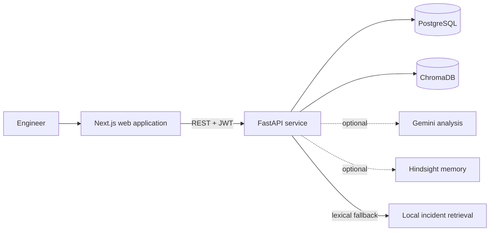

# IncidentMind AI


> **Tagline:** Turn incident reports into reusable operational knowledge.

**Elevator pitch:** IncidentMind AI gives engineering teams one place to report incidents, retrieve relevant operational history, assess evidence-backed response suggestions, and preserve verified resolutions for future responders.

**One-line description:** A full-stack incident response workspace with searchable incident memory and AI-assisted analysis.

> **Project status:** Portfolio and technical-evaluation project. The supplied Compose setup supports local development and demonstrations; it is not a hardened multi-tenant production deployment. Review [deployment and security guidance](docs/DEPLOYMENT.md) before using real operational data.

## Problem

Incident details, troubleshooting notes, and verified fixes are often spread across tickets, chat threads, and individual memory. During an outage, responders must search those sources under time pressure. Teams may repeat failed mitigation attempts or lose useful findings when an incident is closed.

## Solution

IncidentMind provides one workflow for reporting incidents, recording response activity, retrieving related history, and saving resolution knowledge. Its analysis surfaces evidence-linked hypotheses and suggested checks; it is advisory and does not execute operational actions.

## Key features

- Register and sign in using JWT-backed authentication.
- Report, search, filter, update, and review incidents.
- View incident timelines, severity and status, and resolution history.
- Retrieve similar records through ChromaDB, with a lexical fallback when the vector service is unavailable.
- Generate evidence-grounded analysis and suggested response checks using historical incident memory.
- Optionally use Gemini for analysis and Hindsight for retain/recall memory.
- Ask the response assistant questions and inspect its incident references.
- Review dashboard metrics, incident history, executive summaries, and recurrence-risk indicators.
- Generate and export structured postmortem drafts.
- Load 50 synthetic sample incidents into an empty database on initial Compose startup.

## System architecture



See [Architecture](docs/ARCHITECTURE.md) for component responsibilities, data flows, and operational boundaries.

## Technology stack

| Layer | Technologies |
|---|---|
| Web application | Next.js 15, React 19, TypeScript, Lucide |
| API | Python 3.11, FastAPI, Pydantic, SQLAlchemy |
| Database | PostgreSQL 16, SQLAlchemy ORM |
| Incident retrieval | ChromaDB with lexical fallback |
| Optional AI and memory | Google Gemini API, Hindsight API |
| Local orchestration | Docker Compose |
| Quality checks | ESLint, TypeScript/Next.js production build, pytest |

## Repository structure

```text
.
├── backend/
│   ├── app/                 # FastAPI application, models, services, and settings
│   ├── migrations/          # SQL schema reference
│   ├── tests/               # Backend unit tests
│   ├── Dockerfile
│   └── requirements.txt
├── docs/
│   ├── ARCHITECTURE.md
│   ├── API.md
│   ├── CONTRIBUTING.md
│   ├── DEPLOYMENT.md
│   ├── REPOSITORY_REVIEW.md
│   └── screenshots/         # Guidance only until reviewed captures exist
├── .github/
│   ├── ISSUE_TEMPLATE/
│   └── pull_request_template.md
├── CODE_OF_CONDUCT.md
├── CONTRIBUTING.md
├── SECURITY.md
├── frontend/
│   ├── scripts/             # Standalone build asset preparation
│   ├── src/app/             # Next.js app routes and UI
│   ├── Dockerfile
│   └── package.json
├── .env.example
├── docker-compose.yml
└── README.md
```

## Installation and environment setup

### Prerequisites

- Docker Desktop with Docker Compose v2, or Docker Engine with the Compose plugin.
- Git.
- For frontend development and checks outside Docker: Node.js 20 or later.
- For backend development and tests outside Docker: Python 3.11.

### Configure environment

From the repository root, create a local environment file:

```powershell
Copy-Item .env.example .env
```

On macOS or Linux:

```bash
cp .env.example .env
```

Edit `.env` before starting the stack:

1. Set a unique `POSTGRES_PASSWORD`.
2. Set `JWT_SECRET` to a cryptographically random value of at least 32 characters.
3. Keep `AI_MODE=mock` for the deterministic local analysis path, or configure Gemini as described in the [deployment guide](docs/DEPLOYMENT.md).
4. Leave the optional Hindsight settings empty unless you have configured that service.

Do not commit `.env` files or real API credentials. The repository ignores local environment files; `.env.example` contains placeholders only.

## Running locally

Start the application from the repository root:

```bash
docker compose up --build
```

Open:

- Web application: <http://localhost:3000>
- API health: <http://localhost:8000/health>
- Interactive API documentation: <http://localhost:8000/docs>

Register an account in the web application. The API service waits for PostgreSQL, initializes SQLAlchemy tables, and runs the seed command. The seed inserts 50 synthetic sample incidents only when the incident table is empty.

Useful commands:

```bash
docker compose ps
docker compose logs -f api
docker compose exec api pytest -q
```

Stop the services and keep database volumes:

```bash
docker compose down
```

**Destructive:** `docker compose down -v` also deletes the PostgreSQL and Chroma volumes.

## API overview

The versioned API prefix is `/api/v1`. Except for `/health`, registration, and login, endpoints require a bearer token:

```http
Authorization: Bearer <access_token>
```

| Area | Endpoints |
|---|---|
| Authentication | `POST /api/v1/auth/register`, `POST /api/v1/auth/login`, `GET /api/v1/auth/me` |
| Incidents | `GET`/`POST /api/v1/incidents`, `GET`/`PATCH`/`DELETE /api/v1/incidents/{id}` |
| Incident context | `GET /api/v1/incidents/{id}/timeline`, `GET /api/v1/incidents/{id}/similar`, `POST /api/v1/incidents/{id}/analyze` |
| Search and reporting | `POST /api/v1/search`, `GET /api/v1/dashboard`, `GET /api/v1/history` |
| Assistant | `GET /api/v1/chat/history`, `POST /api/v1/chat` |

Severity values are `critical`, `high`, `medium`, and `low`. Status values are `open`, `investigating`, `mitigated`, and `resolved`. See the complete [API reference](docs/API.md) or use Swagger at `/docs` while the API is running.

## Documentation

- [Architecture](docs/ARCHITECTURE.md)
- [API reference](docs/API.md)
- [Deployment and operations](docs/DEPLOYMENT.md)
- [Contributing guide](docs/CONTRIBUTING.md)
- [Repository improvement review](docs/REPOSITORY_REVIEW.md)
- [Screenshot guidance](docs/screenshots/README.md)

## Future enhancements

- Add user-scoped incident authorization, role-based access controls, and configurable registration policies.
- Add database migrations and automated backup/restore procedures for managed deployments.
- Add API rate limiting, security headers, and production secret management.
- Add integration and browser-level end-to-end tests to CI.
- Add incident ownership, service catalog integrations, and richer audit events.
- Add observability dashboards, alerting, and measured resolution-time reporting.
- Add reviewed product screenshots when captures are available.

## Contributing

Bug reports, focused improvements, and documentation contributions are welcome. Before opening a pull request, please read the [contribution guide](CONTRIBUTING.md), review the [code of conduct](CODE_OF_CONDUCT.md), and use the repository issue and pull request templates. Do not include credentials, private incident records, or generated local data in a contribution.

## License

No license file is currently provided. Unless a license is added, the project is not granted an open-source license; obtain maintainer approval before redistributing or reusing it.

## Contributors

Contributions are welcome; see [CONTRIBUTING.md](CONTRIBUTING.md) for the project workflow and checks. The repository is maintained by [@pranathi-pamu02](https://github.com/pranathi-pamu02).

## Contact

- **Maintainer:** [@pranathi-pamu02](https://github.com/pranathi-pamu02)
- **Questions and feature proposals:** [GitHub Issues](https://github.com/pranathi-pamu02/IncidentMind-AI/issues)
- **Security concerns:** Follow [SECURITY.md](SECURITY.md); do not disclose vulnerabilities in a public issue.

## Suggested GitHub About section

- **Description:** AI-assisted incident management workspace with searchable operational memory, similar-incident retrieval, and evidence-grounded response analysis.
- **Topics:** `incident-management`, `incident-response`, `incident-memory`, `fastapi`, `nextjs`, `react`, `typescript`, `postgresql`, `chromadb`, `docker-compose`, `generative-ai`
- **Website:** `http://localhost:3000` is for local development only. Leave the GitHub Website field blank until a maintained public deployment is available.
