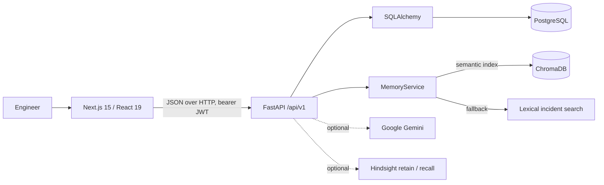

# Architecture

## System context

IncidentMind is a browser-based incident workspace backed by a REST API. The frontend calls FastAPI with JSON requests and a bearer JWT. FastAPI stores the system of record in SQLAlchemy-backed relational tables and coordinates incident retrieval and optional AI integrations.

The Compose deployment exposes the web application on port `3000` and the API on port `8000`. PostgreSQL and ChromaDB run as separate Compose services with named data volumes.

## Components

### Web application

The Next.js App Router application uses a client-side workspace in `frontend/src/app/page.tsx`. It presents authentication, dashboard, incident list and details, incident memory, the response assistant, and executive summary views. The catch-all route renders that same application for client-side destinations.

Authentication tokens and basic user identity are stored in browser local storage. The UI attaches the token to protected API calls. Generated postmortem drafts are built from incident and analysis data in the browser and saved to local storage; they are not a backend-generated artifact.

### API

The FastAPI application in `backend/app/main.py` provides versioned endpoints under `/api/v1`, except for the public `/health` endpoint. SQLAlchemy metadata creates tables at API startup. Protected endpoints use bearer-token authentication; registration and login issue expiring JWTs.

Incident, user, timeline-event, and chat-message models are defined in `backend/app/models.py`. The migration SQL in `backend/migrations/001_initial.sql` is a schema reference; startup currently uses SQLAlchemy `create_all`, not an automated migration runner.

### Relational store

PostgreSQL is the Compose database and system of record. It holds user accounts, incident fields and outcomes, incident timeline events, and persisted assistant messages. Compose stores data in the `postgres_data` named volume.

### Incident memory

`MemoryService` indexes searchable incident text in ChromaDB when available. Search results are hydrated from relational incident records. When Chroma cannot be reached or returns no candidates, the service uses a deterministic lexical overlap fallback against incident text.

An optional Hindsight integration sends incident retain requests and recalls contextual memory when configured. Integration failures are logged and do not replace the relational incident record.

### Analysis

With a Gemini API key and a non-mock `AI_MODE`, the service attempts to produce a structured, evidence-grounded analysis. Without that configuration, or if generation fails, the analyzer uses similar historical incidents and a cautious local fallback. Suggestions are advisory; the application does not execute operational actions.

## Incident data flow

1. An authenticated engineer creates or updates an incident through the web application.
2. The API validates the request, persists the incident and relevant timeline events, and updates available memory integrations.
3. Incident detail requests can retrieve similar records and request an analysis based on those records.
4. The UI displays matches, confidence, suggested checks, and a recurrence-risk heuristic with its contributing factors.
5. Engineers can record a verified root cause, resolution, and notes. The API persists updates, appends timeline entries for status/resolution changes, and refreshes incident memory.
6. Assistant exchanges are stored per user. Postmortem drafts remain browser-local.

## Startup and sample data

The Compose API command runs `python -m app.seed` before starting Uvicorn. The seed routine inserts 50 synthetic examples only if the incident table is empty, then attempts to index them. SQLAlchemy metadata initialization also runs when the API starts.

## Security boundaries and known limitations

- API access uses JWT authentication, but current incident list and detail data are not scoped to the authenticated user or a tenant.
- Registration is open. Restrict account creation before making the service available to an untrusted audience.
- Browser tokens are stored in local storage; production deployments should review their client-side threat model.
- Use a managed secret store, TLS, database backups, access controls, rate limits, monitoring, and a private/authenticated vector service for production.
- `/docs` is enabled by the current FastAPI application. Restrict or disable interactive API documentation if deployment policy requires it.
- `docker compose down -v` deletes persistent database and Chroma volumes.
